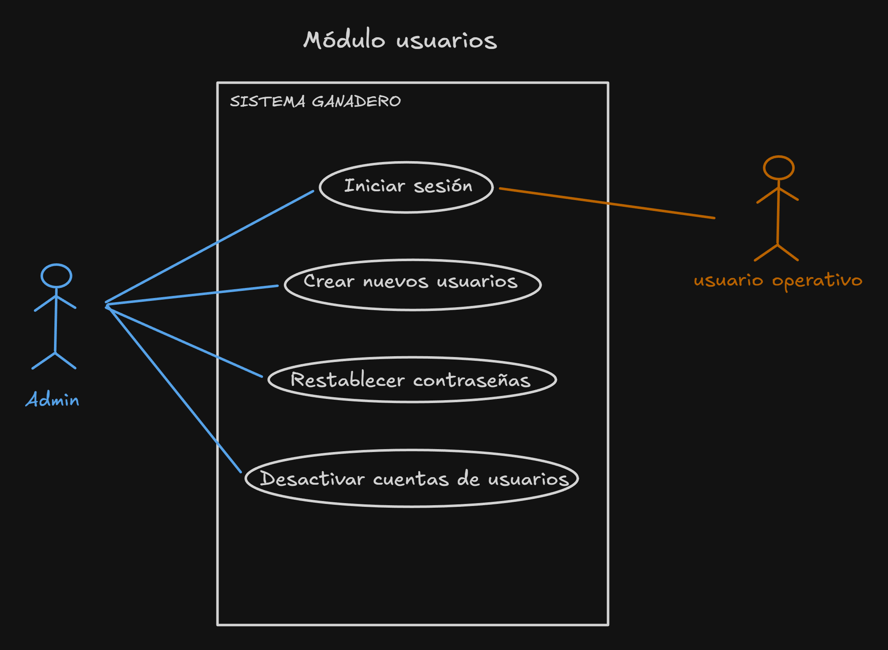
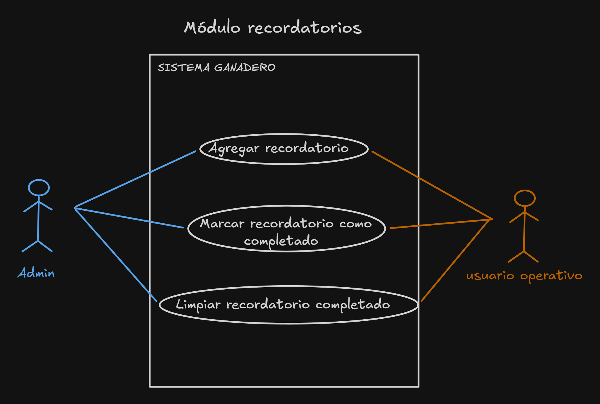
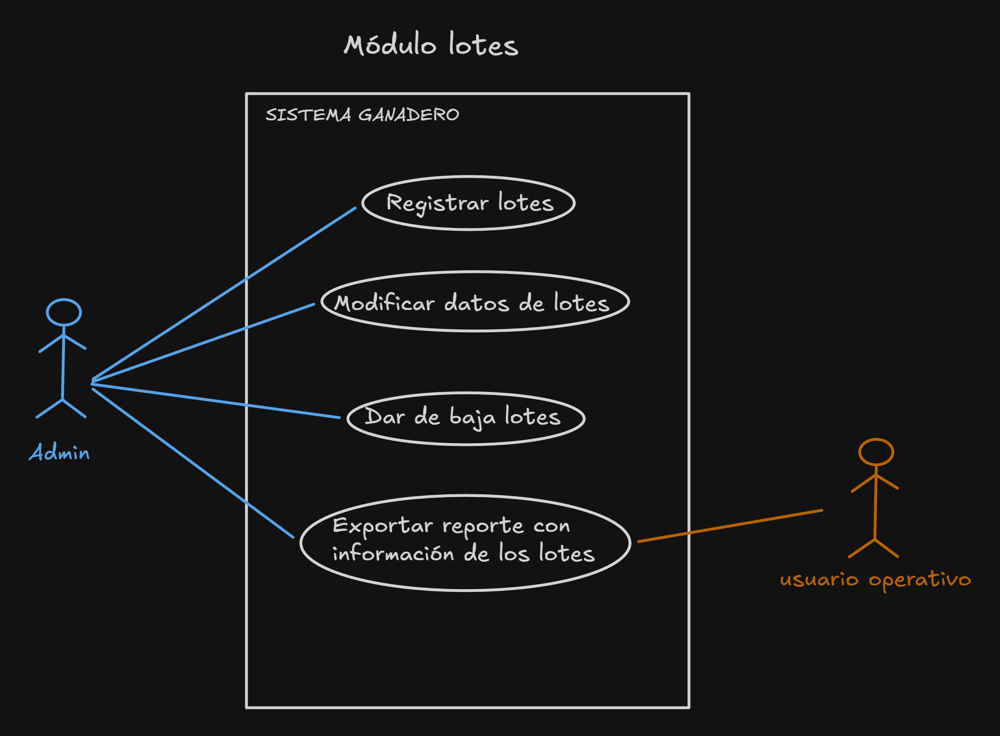
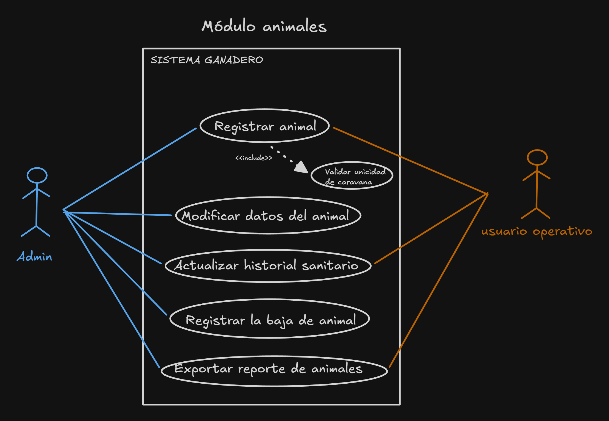
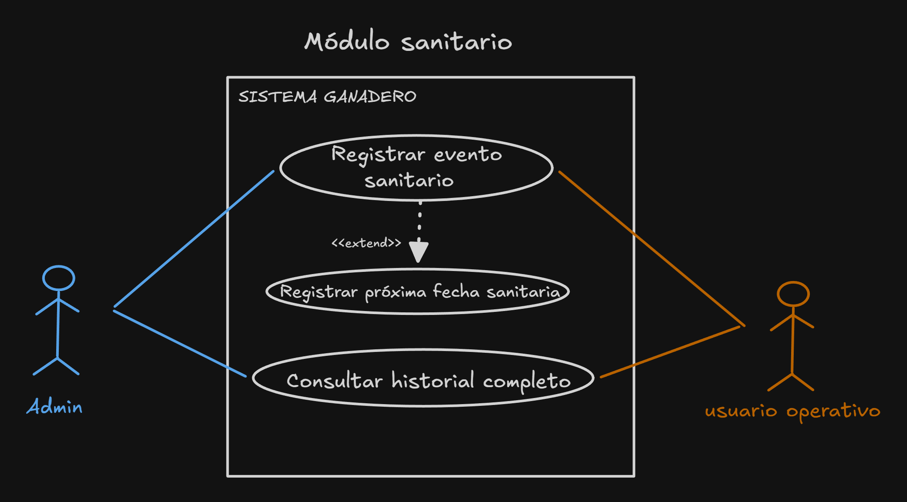
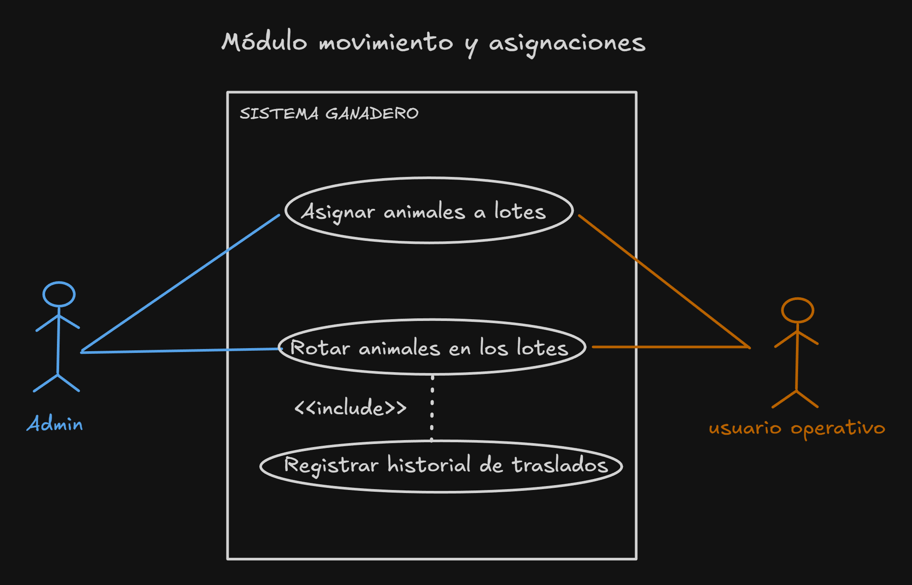

# SISTEMA DE LOTEO Y GESTIÓN DE ANIMALES

> **Institución:** ISFT N°190  
> **Carrera:** Análisis de Sistemas  
> **Materia:** Prácticas Profesionalizantes III  
> **Profesor:** Benvenuto Daniel  
> **Estudiante:** Aranda Matías  
> **Año:** 2026  

## 1. Introducción
En la gestión de establecimientos ganaderos, el registro de rodeos, rotación de potreros y controles sanitarios suele realizarse mediante anotaciones manuales, lo que incrementa el riesgo de pérdidas de datos y dificulta la trazabilidad individual.

El presente proyecto consiste en el desarrollo de una aplicación de escritorio orientada a centralizar y digitalizar la administración del ganado. El sistema permite controlar el inventario de animales mediante identificación por caravana única, gestionar el historial sanitario y supervisar la ocupación y permanencia de los ejemplares en los distintos lotes.

## 2. Objetivos
- **Digitalizar los registros de cada animal para resguardar su información completa.**
- **Administrar eficientemente las rotaciones y ocupaciones de pasturas.**
- **Permitir una gestión eficaz en entornos donde no hay conexión a internet.**
- **Planificar actividades ganaderas con seguimiento.**
- **Agilizar búsquedas sobre información específica de los animales.**

## 3. Relevamientos
- **Metodología de relevamiento:** Para el levantamiento de información y especificación de requerimientos se utilizó una técnica cualitativa de **Observación Directa, Participante, No Estructurada y Visible**, desarrollada a lo largo de un período de 6 meses en la estancia "El Recuerdo".

- **Modalidad de registro:** Registro diferido mediante notas retrospectivas de campo, priorizando la cooperación operativa.

- **Criterio de sistematización:** Agrupamiento de hallazgos por hitos productivos, sanitarios y de gestión territorial.

### 3.1 Acontecimientos operativos observados
<details>
  <summary><b> Ver más </b></summary>

### Acta de vacunación
- **Contexto de observación:** Vacunación completa de la hacienda.
- **Operación observada:**  
**OTOÑO**: marzo/abril     
    - Aplicación de vacuna para aftosa (1ra dosis).     
    - Aplicación de vacuna para brucelosis solo terneros hembra.   
    - Aplicación de vacuna para carbunclo a todo lo mayor de un año de edad. 

   **PRIMAVERA**: junio/julio  
    - Aplicación de vacuna para aftosa solo terneros y terneras (2da dosis). 

### Sanidad de los terneros
- **Contexto de observación:** Tareas realizadas a terneros de tres meses de edad para inmunizarlos.  
- **Operación observada:** 
    - Aplicación de vacuna quíntuple/sextuple para inmunizar (1er dosis).  
    - Aplicación de complejo respiratorio.  
    INTERVALO DE 21 DÍAS  
    - Aplicación de vacuna quíntuple/sextuple para inmunizar (2da dosis).  

### Destete 
- **Contexto de observación:** Se separan las crías de la madre cuando empiezan a comer solos o cuando la madre baja su condición.  
- **Operación observada:** 
    - Separación de madres, cambio de lote de sus crías.  
    - Aplicación de complejo vitamínico.  
    - Aplicación de antiparasitario.  

### Castración
- **Contexto de observación:** En el lote de terneros se separan a los machos para la castración.  
- **Operación observada:** 
    - Aplicación de anillos de goma para la castración.  
    - Aplicación de complejo vitamínico según el estado del animal.  
    INTERVALO DE 21 DÍAS  
    - Revisión y curación según la cicatrización del animal.  
    - Aplicación de complejo vitamínico según el estado del animal.  

### Pre-servicio vaquillonas
- **Contexto de observación:** Labor realizado antes de la temporada reproductiva.
- **Operación observada:**
    - Se seleccionan las vaquillonas que van a servirse.  
        - Se observa su pureza.  
        - Se observa sus aplomos.  
    - Aplicación de complejo reproductivo (1er dosis).  
    INTERVALO DE 21 DÍAS  
    - Aplicación de complejo reproductivo (2da dosis).

### Pre-servicio toros
- **Contexto de observación:** Tareas realizadas por el veterinario 60 / 90 días antes de la temporada reproductiva.
- **Operación observada:**  
    - Se realiza el raspado prepucial para análisis de laboratorio.
    - Se toman muestras de sangre para análisis de laboratorio.

### Descarte
- **Contexto de observación:** Los animales se venden según el criterio del dueño de campo.  
- **Operación observada:**  
**BAJA REPRODUCTIVIDAD**  
    - Lotes de vaquillonas con aplomos anormales o razgos de impureza.  
    - Lotes de vacas viejas.  
    - Lotes de toros viejos.  

    **KILAJE Y VALOR**  
    - Lotes de novillos.  
    - Lotes de terneros.  

### Rotación de animales
- **Contexto de observación:** El suelo necesita períodos de descanso de pastoreo y los animales deben ganar peso.  
- **Operación observada:**  
    - Movimientos de animales para preparar una pastura.  
    - Movimientos de animales para evitar erosión.  
    - Movimientos de animales para aprovechar el alimento de otros lotes.  

### División de lotes
- **Contexto de observación:** Se subdividen los lotes en sistemas intensivos para el engorde pre-venta o para mejoría cárnica general.  
- **Operación observada:**  
    - División en melgas de sorgo cada 3 días.
    - División en melgas de avena cada 3 días.
</details>


### 3.2 Diagnóstico general y necesidades del sistema
<details>
  <summary><b> Ver más </b></summary>

- **Dependencia del papel:** Por lo general, el dueño de campo es quien posee las planillas y anotaciones con la información del campo. Esos documentos se mezclan con otros, se vuelan y manchan, y muchas veces quedan ilegibles. También sucede que los demás trabajadores no tienen acceso a esa información más que preguntando y a veces memorizando (lo que lo hace ineficiente).    
    - **Necesidad del sistema:** Centralizar la información para que cualquier usuario autorizado pueda consultarla e incorporar un módulo de recordatorios para asignar labores o para asignar eventos importantes, además de restringir las funcionalidades según el rol del usuario (administrador y usuarios operativos).   

- **Falta de visibilidad y control en los movimientos de hacienda:** Los movimientos de hacienda no se anotan, por lo que terminan siendo de palabra. No se lleva un registro de por donde estuvieron pastando esos animales, lo que puede llevar a rotaciones repetitivas dentro de un lote o sobrepastoreo en potreros que necesitan recuperarse.  
    - **Necesidad del sistema:** Registrar la asignación de animales a lotes, con un historial de movimientos para lograr un seguimiento minucioso. Además, cada lote puede mutar, ya sea expandiéndose o dividiéndose. El sistema debe lograr agregar, modificar e exportar un reporte con la información de cada lote, impidiendo además dar de baja los que todavía contengan hacienda adentro.   


- **Inconsistencias y pérdidas en el registro de animales:** En el ingreso manual de la información de los animales es posible que se cometan errores como repetir números de caravana, ingresar información errónea o confundir el estado actual del animal.
    - **Necesidad del sistema:** Registrar la información de cada animal, validando sus caravanas y modificando la información, ya sea por algún error o por recategorización y registrar la baja de cada uno indicando el motivo. También debe poder exportar un reporte con la cantidad de animales y su información. 
</details>


## 4. Requerimientos del sistema
### 4.1 Requerimientos Funcionales (RF)
<details>
  <summary><b> Módulos </b></summary>

### Módulo 1: Gestión de usuarios
- **RF01:** El sistema debe exigir el ingreso de credenciales para acceder al sistema.
- **RF02:** El sistema debe restringir las funciones disponibles según el rol del usuario.
- **RF03:** El sistema debe permitir crear nuevos usuarios.
- **RF04:** El sistema debe permitir restablecer contraseñas.
- **RF05:** El sistema debe permitir desactivar cuentas de usuarios.

### Módulo 2: Gestión de recordatorios
- **RF06:** El sistema debe permitir agregar recordatorios.
- **RF07:** El sistema debe permitir marcar los recordatorios como completados. 
- **RF08:** El sistema debe permitir eliminar los recordatorios completados.

### Módulo 3: Gestión de lotes
- **RF09:** El sistema debe permitir registrar nuevos lotes con nombre y cantidad de ha.
- **RF10:** El sistema debe permitir modificar los datos de los lotes existentes.
- **RF11:** El sistema debe permitir dar de baja un lote que no esté ocupado por animales.
- **RF12:** El sistema debe permitir exportar un reporte con la información actual de los lotes.

### Módulo 4: Gestión de animales
- **RF13:** El sistema debe permitir registrar nuevos animales con caravana, sexo, tipo, raza, categoría, fecha de nacimiento, peso aproximado, observaciones y estado actual del animal.
- **RF14:** El sistema debe permitir modificar los datos de los animales existentes.
- **RF15:** El sistema debe validar las caravanas para que no existan animales duplicados.
- **RF16:** El sistema debe permitir registrar la baja de los animales indicando el motivo.
- **RF17:** El sistema debe permitir exportar un reporte con la información de los animales.

### Módulo 5: Gestión de sanidad
- **RF18:** El sistema debe permitir registrar eventos sanitarios de forma individual por caravana.
- **RF19**: El sistema debe permitir aplicar tratamientos sanitarios en bloque seleccionando un lote completo.
- **RF20**: El sistema debe registrar fecha de aplicación, tipo de tratamiento, producto administrado, observaciones y usuario responsable para cada intervención.
- **RF21**: El sistema debe mantener y permitir consultar el historial sanitario cronológico completo de cada animal.
- **RF22**: El sistema debe permitir registrar una fecha de próxima aplicación o refuerzo sanitario, generando una entrada en el módulo de recordatorios vinculada al lote o animal.


### Módulo 6: Movimientos y asignaciones
- **RF23:** El sistema debe permitir asignar a los animales a los lotes determinados.
- **RF24:** El sistema debe permitir la rotación de los animales en los distintos lotes.
- **RF25:** El sistema debe almacenar un historial de cada traslado indicando fecha, lote de origen, lote de destino y usuario responsable.
</details>

<details>
  <summary><b> Matriz de permisos por rol </b></summary>

| Requerimientos funcionales | Rol Admin | Rol Usuario |
| :--- | :---: | :---: |
| **RF03** Crear nuevos usuarios | **🗸** | **X** |
| **RF04** Restablecer contraseñas | **🗸** | **X** |
| **RF05** Desactivar cuentas de usuarios | **🗸** | **X** |
| **RF06** Agregar recordatorios | **🗸** | **🗸** |
| **RF07** Marcar recordatorios como completados | **🗸** | **🗸** |
| **RF08** Eliminar recordatorios completados | **🗸** | **🗸** |
| **RF09** Registrar nuevos lotes | **🗸** | **X** |
| **RF10** Modificar datos de lotes | **🗸** | **X** |
| **RF11** Dar de baja lote desocupado | **🗸** | **X** |
| **RF12** Exportar reporte de lotes | **🗸** | **🗸** |
| **RF13** Registrar nuevos animales | **🗸** | **🗸** |
| **RF14** Modificar datos de animales | **🗸** | **X** |
| **RF16** Registrar baja de animales con motivo | **🗸** | **X** |
| **RF17** Exportar reporte de animales | **🗸** | **🗸** |
| **RF18** Registrar evento sanitario individual | **🗸** | **🗸** |
| **RF19** Registrar tratamiento sanitario por lote | **🗸** | **🗸** |
| **RF20** Registrar detalle, fecha y responsable de sanidad | **🗸** | **🗸** |
| **RF21** Consultar historial sanitario de animal | **🗸** | **🗸** |
| **RF22** Programar recordatorio de refuerzo sanitario | **🗸** | **🗸** |
| **RF23** Asignar animales a lotes | **🗸** | **🗸** |
| **RF24** Rotar animales en los lotes | **🗸** | **🗸** |
</details>

<details>
  <summary><b> Priorización de Requerimientos (Método MoSCoW) y Criterios de Aceptación </b></summary>

| RF | Origen | Prioridad | Criterio de Aceptación |
| :--- | :--- | :---: | :--- |
| **RF01** | Seguridad básica de acceso | **Must Have** | Valida usuario y contraseña; bloquea accesos no autorizados con mensaje neutro. |
| **RF02** | Operación diferenciada por rol | **Must Have** | Inhabilita/oculta opciones administrativas a usuarios con rol operativo. |
| **RF03** | Alta de personal | **Should Have** | Guarda nuevo usuario con username único y clave procesada mediante hash seguro. |
| **RF04** | Olvidos frecuentes de credenciales | **Could Have** | Permite al admin reescribir la contraseña de una cuenta existente. |
| **RF05** | Baja de personal sin perder historial | **Could Have** | Desactiva la cuenta mediante baja lógica bloqueando el login futuro. |
| **RF06** | Eventos importantes como ventanas sanitarias o labores | **Could Have** | Registra evento con fecha programada y lo visualiza en el panel de pendientes. |
| **RF07** | Concreción de tareas propuestas | **Could Have** | Permite marcar como completado un recordatorio pendiente. |
| **RF08** | Acumulación de tareas finalizadas | **Could Have** | Elimina del panel los recordatorios marcados como completados. |
| **RF09** | Delimitación física de potreros | **Must Have** | Da de alta un lote registrando nombre único y cantidad positiva de hectáreas. |
| **RF10** | Cambios de características del lote | **Could Have** | Actualiza nombre o hectáreas sin alterar la hacienda asignada al lote. |
| **RF11** | Cambio de propósito o reorganización de potreros | **Must Have** | Bloquea la baja si el lote posee animales; permite baja si el stock actual es cero. |
| **RF12** | Consulta y control de la información territorial | **Could Have** | Genera reportes detallados con lista de lotes, hectáreas y cantidad de cabezas. |
| **RF13** | Nacimientos, compras y destete | **Must Have** | Guarda ficha individual del animal con todos sus campos obligatorios completos. |
| **RF14** | Errores de carga o recategorización | **Could Have** | Permite editar datos descriptivos (peso, estado, categoría) conservando la caravana. |
| **RF15** | Duplicación accidental en libretas de campo | **Must Have** | Impide guardar un animal si la caravana ya existe activa en la base de datos. |
| **RF16** | Ventas, mortandad y descartes | **Must Have** | Exige motivo de egreso (venta, muerte, descarte) y desvincula al animal del lote actual. |
| **RF17** | Conteo para SENASA, camión, manga o control | **Could Have** | Genera listado filtrado por lote, categoría o estado para uso operativo y auditoría. |
| **RF18** | Atención clínica o curación puntual | **Must Have** | Asocia de forma unívoca el tratamiento sanitario a la caravana ingresada. |
| **RF19** | Campañas de vacunación general | **Should Have** | Aplica el registro en una sola acción a todos los animales activos del lote seleccionado. |
| **RF20** | Auditoría y trazabilidad sanitaria | **Must Have** | Almacena obligatoriamente fecha, producto administrado y el usuario logueado actuante. |
| **RF21** | Antecedentes sanitarios por animal | **Should Have** | Muestra el listado cronológico de las intervenciones recibidas por una caravana. |
| **RF22** | Intervalos sanitarios (refuerzos de 21 días) | **Should Have** | Crea un recordatorio pendiente con fecha calculada y descripción de la labor a repetir. |
| **RF23** | Asignación de hacienda no registrada o nueva | **Must Have** | Asigna por primera vez los animales a lotes existentes incrementando el stock actual. |
| **RF24** | Manejo de pasturas y descanso | **Must Have** | Traslada animales entre lotes: descuenta stock en origen y suma en lote destino. |
| **RF25** | Trazabilidad y auditoría de campo | **Must Have** | Guarda un historial con fecha, lote origen, lote destino y usuario logueado. |
</details>


### 4.2 Requerimientos No Funcionales (RNF)
<details>
  <summary><b> Requerimientos No Funcionales </b></summary>

- **RNF01 - Seguridad de credenciales:** El sistema debe aplicar funciones de resumen criptográfico en la base de datos para las contraseñas.
- **RNF02 - Políticas de contraseña:** Toda nueva contraseña o cambio de credencial debe exigir una longitud mínima de 8 caracteres e incluir al menos una letra mayúscula, una minúscula y un número.
- **RNF03 - Intentos de acceso:** El sistema debe bloquear temporalmente el acceso por un lapso de 5 minutos tras 3 intentos fallidos consecutivos de inicio de sesión sobre una misma cuenta.
- **RNF04 - Consistencia visual:** La interfaz debe presentar un diseño homogéneo.
- **RNF05 - Retroalimentación y usabilidad:** La interfaz debe ofrecer mensajes claros ante el ingreso de datos inválidos.
- **RNF06 - Disponibilidad e independencia de la red:** El sistema debe operar de forma 100% autónoma en el equipo de escritorio del establecimiento rural, garantizando una disponibilidad operativa del 99% en jornadas laborales, sin requerir conexión continua a internet para sus funciones principales.
- **RNF07 - Atomicidad de transacciones:** Todas las operaciones que involucren movimientos de hacienda y cambios de estado deben ejecutarse bajo transacciones atómicas (ACID), garantizando que si una operación falla, se reviertan los cambios al 100%.
- **RNF08 - Integridad de datos:** El sistema debe garantizar la consistencia en la base de datos evitando registros huérfanos.
- **RNF09 - Trazabilidad e inmutabilidad:** Los registros del historial de traslados no deben admitir operaciones de modificación ni de eliminación física.
- **RNF10 - Respaldo local:** El sistema debe permitir la ejecución de copias de seguridad (*backup*) completas de la base de datos en almacenamiento secundario.
</details>

<details>
  <summary><b> Prioridad y criterio medible </b></summary>

| RNF | Requisito | Categoría | Prioridad | Criterio medible |
| :--- | :--- | :--- | :---: | :--- |
| **RNF01** | Seguridad de credenciales | Seguridad | **Must Have** | Ninguna de las contraseñas almacenadas en texto plano (aplicación de hash criptográfico). |
| **RNF02** | Políticas de contraseña | Seguridad | **Must Have** | Longitud mínima de 8 caracteres con validación estricta de mayúscula, minúscula y número. |
| **RNF03** | Intentos de acceso | Seguridad | **Could Have** | Bloqueo exacto de 5 minutos al registrar el tercer intento fallido consecutivo. |
| **RNF04** | Consistencia visual | Usabilidad | **Should Have** | 100% de los formularios y controles respetan la misma paleta, tipografía y distribución. |
| **RNF05** | Retroalimentación y usabilidad | Usabilidad | **Must Have** | 100% de los errores de validación muestran mensajes comprensibles indicando el campo afectado. |
| **RNF06** | Disponibilidad e independencia de red | Disponibilidad | **Must Have** | 99% de disponibilidad operativa en jornada de trabajo sin depender de conexión a internet. |
| **RNF07** | Atomicidad de transacciones | Integridad | **Must Have** | Reversión total ante interrupciones forzadas en traslados o cambios de estado. |
| **RNF08** | Integridad de datos | Integridad | **Must Have** | Cero registros huérfanos mediante claves foráneas y restricciones relacionales activas. |
| **RNF09** | Trazabilidad e inmutabilidad | Auditoría | **Must Have** | Ninguna sentencia de actualización o borrado permitida sobre la tabla de historial. |
| **RNF10** | Respaldo local | Mantenibilidad | **Should Have** | Generación de copia de seguridad íntegra de la base de datos en almacenamiento secundario. |
</details>

### Diagramas de Casos de Uso (DCU) y Casos Prioritarios

<details>
  <summary><b> Módulo Usuarios</b></summary>
  <br>
  <p align="center">
    
  </p>

- **Actor:** Admin

- **Precondiciones: El usuario está autenticado con rol Admin.**

- **Flujo Principal:**

  - 1. El administrador accede al módulo de usuarios y selecciona "Agregar usuario".
  - 2. El sistema despliega el formulario solicitando: nombre, apellido, nombre de usuario, contraseña y rol (Admin u Operativo).
  - 3. El administrador completa los datos y solicita el registro.
  - 4. El sistema valida que el nombre de usuario no se encuentre registrado previamente y que la contraseña cumpla los requisitos de seguridad.
  - 5. El sistema almacena el nuevo usuario en estado "Activo".
  - 6. El sistema muestra un mensaje confirmando el alta exitosa del usuario.

- **Operaciones complementarias:**

  - Restablecer contraseñas de usuarios existentes.
  - Desactivar cuentas de usuario (baja lógica conservando el historial de sus acciones).
  - Modificar datos o rol del usuario.
</details>

<details>
  <summary><b> Módulo Recordatorios</b></summary>
  <br>
  <p align="center">
    
  </p>
Gestionar recordatorios:

- **Actores:** Admin / Usuario operativo

- **Precondiciones:** El usuario está autenticado en el sistema.

- **Flujo Principal:**

  - 1. El usuario accede al módulo de recordatorios y selecciona "Nuevo recordatorio".
  - 2. El sistema presenta el formulario de carga solicitando: título de la labor, fecha programada, descripción opcional y asignación a un lote o animal si corresponde.
  - 3. El usuario completa los campos requeridos y confirma el guardado.
  - 4. El sistema valida que la fecha ingresada sea válida y que los campos requeridos contengan información.
  - 5. El sistema registra el recordatorio en estado "Pendiente".
  - 6. El sistema emite un mensaje confirmando la programación de la tarea.

- **Operaciones complementarias:**

  - Marcar recordatorios como completados.
  - Eliminar recordatorios ya completados.
  - Visualizar recordatorios automáticos generados desde el módulo de sanidad (refuerzos de 21 días).

</details>

<details>
  <summary><b> Módulo Lotes</b></summary>
  <br>
  <p align="center">
    
  </p>
  **Gestionar lotes:** 

- **Actor:** Admin

- **Precondiciones:** El usuario está autenticado con rol Admin.

- **Flujo Principal:**  
  - 1. El usuario accede al módulo de lotes y selecciona "Agregar lote".
  - 2. El sistema presenta el formulario de carga solicitando: nombre y cantidad de hectáreas.
  - 3. El usuario completa los datos y confirma la creación.
  - 4. El sistema valida que el nombre del lote no esté repetido en el establecimiento y que la superficie sea un valor numérico positivo.
  - 5. El sistema registra el nuevo lote como disponible.
  - 6. El sistema emite un mensaje confirmando el alta exitosa del lote.

- **Operaciones complementarias:**
  - Modificar información.
  - Dar de baja si se encuentra desocupado.
  - Exportar reporte con su información.
</details>

<details>
  <summary><b> Módulo Animales</b></summary>
  <br>
  <p align="center">
    
  </p>
  **Gestionar animales:**

- **Actores:** Admin / Usuario operativo

- **Precondiciones:** El usuario debe estar autenticado en el sistema y existe al menos un lote disponible.

- **Flujo Principal**
  - 1. El usuario accede al módulo de animales y selecciona "Agregar animal".
  - 2. El sistema despliega el formulario solicitando los datos del animal y lotes disponibles.
  - 3. El usuario completa los datos requeridos y selecciona el lote al que se asignará.
  - 4. El usuario solicita guardar la información.
  - 5. El sistema valida que los campos obligatorios estén completos y que el número de caravana no esté duplicado.
  - 6. El sistema guarda el nuevo animal con estado "Activo" y actualiza el contador de cabezas del lote asignado.
  - 7. El sistema muestra un mensaje de confirmación notificando el registro exitoso.

- **Operaciones complementarias:**
  - Modificar información.
  - Actualizar el historial sanitario.
  - Dar de baja indicando el motivo.
  - Exportar reporte con su información.
</details>

<details>
  <summary><b> Módulo Sanidad</b></summary>
  <br>
  <p align="center">
    
  </p>
  **Gestionar sanidad:**

- **Actores:** Admin / Usuario operativo

- **Precondiciones:** El usuario está autenticado en el sistema y existen animales registrados.

- **Flujo Principal:**
  - 1. El usuario accede a la sección de sanidad (dentro del módulo de animales).
  - 2. El sistema solicita seleccionar la modalidad: individual (por animal) o masiva (por lote).
  - 3. El usuario selecciona el animal o filtra y selecciona el lote a intervenir.
  - 4. El usuario completa los datos del tratamiento: tipo de vacuna/medicamento, fecha de aplicación y observaciones.
  - 5. El usuario solicita guardar la aplicación.
  - 6. El sistema valida los datos y registra el evento sanitario en el historial de cada animal correspondiente.
  - 7. El sistema muestra un mensaje de confirmación notificando la actualización sanitaria exitosa.

- **Operaciones complementarias:**

  - Consultar historial sanitario completo por caravana.
  - Programar recordatorio de refuerzo o próxima aplicación en el calendario.
  - Exportar reporte sanitario por lote o fecha.
  - Modificar o anular un registro sanitario erróneo (exclusivo Admin).
</details>

<details>
  <summary><b> Módulo Movimiento y Asignaciones</b></summary>
  <br>
  <p align="center">
    
  </p>
  **Gestionar movimientos:**

- **Actores:** Admin / Usuario operativo

- **Precondiciones**: El usuario está autenticado en el sistema y existen lotes con animales activos asignados.

- **Flujo Principal:**
  - 1. El usuario accede al módulo de traslados/movimientos y selecciona "Nuevo traslado".
  - 2. El sistema solicita seleccionar el lote de origen.
  - 3. El usuario elige el lote de origen y el sistema lista los animales presentes en él.
  - 4. El usuario selecciona los animales a mover (o marca lote completo) y elige el lote de destino.
  - 5. El usuario solicita confirmar el movimiento.
  - 6. El sistema valida que el lote de origen y destino sean distintos.
  - 7. El sistema descuenta la hacienda del lote origen, la asigna al lote destino y registra el evento en el historial con fecha, hora y usuario responsable.
  - 8. El sistema muestra un mensaje de confirmación de traslado exitoso.

- **Operaciones complementarias:**
  - Consultar el historial cronológico de traslados.
</details>

## 5. Arquitectura
El sistema implementa una arquitectura monolítica de escritorio, estructurada internamente bajo un patrón de tres capas lógicas de diseño:

1. **Capa de presentación:** Formularios y pantallas donde el usuario interactúa, carga datos y ve reportes.

2. **Capa de procesamiento de la aplicación:** Módulos que procesan e implementan la lógica y las reglas operativas del sistema.

3. **Capa de gestión de datos:** Conexión y consultas SQL para guardar y leer la información en la base de datos local.

### 5.1 Herramientas utilizadas 

- **Lenguaje de programación:** Python 3.14.7
    - **CustomTkinter:** Librería para diseño y desarrollo de la interfaz de usuario.
- **Base de datos:** MySQL 8.0.46
    - **MySQL Workbench 8.0 CE:** Modelado y administración de la base de datos.
- **Entorno de desarrollo:** Visual Studio Code.

## 6. Modelo de datos

<details>
  <summary><b> Diagrama Entidad-Relación (DER) </b></summary>

El sistema implementa un modelo relacional normalizado compuesto por seis entidades principales:

**ANIMALES (1) a SANIDAD (N):** Un animal puede registrar múltiples eventos sanitarios a lo largo de su vida productiva.  

**ANIMALES (1) a HISTORIAL_PASTOREO (N):** Un animal registra múltiples ingresos y egresos de distintos lotes conforme rota en el pastoreo.  

**LOTES (1) a HISTORIAL_PASTOREO (N):** Un lote recibe múltiples estadías y traslados de animales a lo largo del tiempo.  

**LOTES (1) a ANIMALES (N):** Un lote puede albergar simultáneamente a múltiples animales activos en su ubicación actual.  

**USUARIOS (1) a HISTORIAL_PASTOREO (N):** Un usuario puede asentar múltiples movimientos de hacienda para fines de auditoría.  

**USUARIOS (1) a SANIDAD (N):** Un usuario puede registrar múltiples intervenciones sanitarias como responsable de la labor.  

**SANIDAD (1) a RECORDATORIOS (N):** Un tratamiento sanitario puede derivar en uno o más recordatorios automáticos de refuerzo.  

```text
┌──────────────────────────┐             ┌──────────────────────────┐
│          LOTES           │             │         USUARIOS         │
├──────────────────────────┤             ├──────────────────────────┤
│ PK  id_lote              │             │ PK  id_usuario           │
│     nombre (UQ)          │             │     nombre_usuario (UQ)  │
│     superficie_ha        │             │     contrasena           │
└────────────┬─────────────┘             │     rol                  │
             │ 1                         └────────────┬─────────────┘
             │                                        │
             │                                        │ 1
             │                                        │
             │ N                                      │
┌────────────┴─────────────┐                          │
│    HISTORIAL_PASTOREO    │                          │
├──────────────────────────┤                          │
│ PK  id_movimiento        │                          │
│ FK  id_lote              │                          │
│ FK  id_animal            │                          │
│ FK  id_usuario           │<─────────────────────────┤ (auditoría)
│     fecha_entrada        │                          │
│     fecha_salida         │                          │
└────────────┬─────────────┘                          │
             │ N                                      │
             │                                        │
             │ 1                                      │
┌────────────┴─────────────┐                          │
│         ANIMALES         │                          │
├──────────────────────────┤                          │
│ PK  id_animal            │                          │
│     caravana (UQ)        │                          │
│     sexo                 │                          │
│     tipo                 │                          │
│     raza                 │                          │
│     categoria            │                          │
│     fecha_nacimiento     │                          │
│     peso_aprox           │                          │
│     observaciones        │                          │
│     estado               │                          │
│ FK  id_lote_actual       │                          │
└────────────┬─────────────┘                          │
             │ 1                                      │
             │                                        │
             │ N                                      │
┌────────────┴─────────────┐                          │
│         SANIDAD          │                          │
├──────────────────────────┤                          │
│ PK  id_sanidad           │                          │
│ FK  id_animal            │                          │
│ FK  id_usuario           │<─────────────────────────┘ (auditoría)
│     tipo_evento          │
│     producto_aplicado    │
│     fecha                │
│     observaciones        │
└────────────┬─────────────┘
             │ 0..1
             │
             │ (refuerzo sanitario)
             │
             │ 0..N
┌────────────┴─────────────┐
│      RECORDATORIOS       │
├──────────────────────────┤
│ PK  id_recordatorio      │
│     texto                │
│     completado           │
│     fecha_programada     │
│     fecha_creacion       │
│ FK  id_animal (opcional) │
│ FK  id_lote (opcional)   │
└──────────────────────────┘

```
</details>

<details>
  <summary><b> Matriz de trazabilidad </b></summary>
  

| Necesidad del negocio | Requisitos Funcionales | Tablas |
| :--- | :--- | :--- |
| **Control de acceso** | RF01, RF02, RF03, RF04, RF05 | `usuarios` |
| **Planificación de tareas** | RF06, RF07, RF08, RF22 | `recordatorios` |
| **Delimitación de potreros** | RF09, RF10, RF11, RF12 | `lotes` |
| **Ficha de hacienda** | RF13, RF14, RF15, RF16, RF17 | `animales` |
| **Control sanitario** | RF18, RF19, RF20, RF21 | `sanidad` |
| **Traslados y rotaciones** | RF23, RF24, RF25 | `historial_pastoreo` |

</details>

